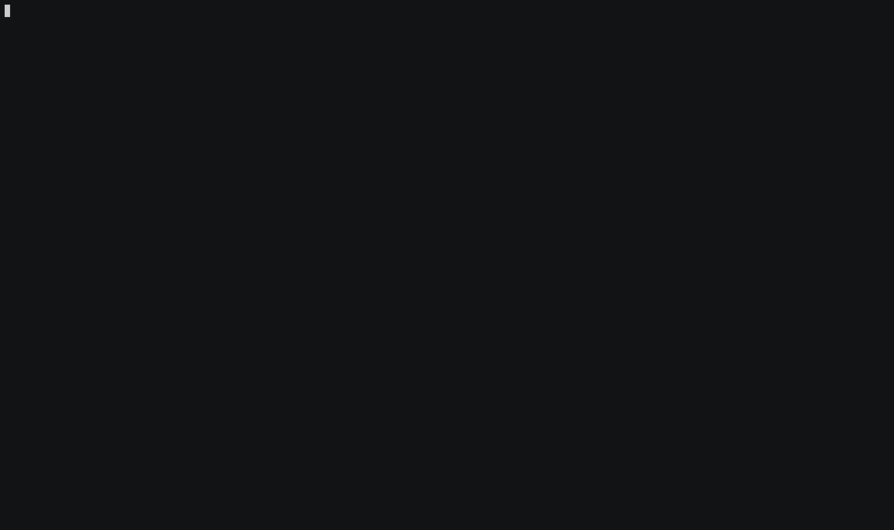

# bgp-rogue

[](https://github.com/incendiary/bgp_rogue/actions/workflows/ci.yml)

A containerised BGP prefix hijack detector. It streams historical BGP route announcements via [pybgpstream](https://bgpstream.caida.org/docs/tools/pybgpstream) and flags any origin AS that is not in your authorised list — a strong signal of a route hijack.



---

## Background

BGP (Border Gateway Protocol) is the routing protocol that connects autonomous systems (ASes) on the internet. Because BGP has no built-in origin validation, a rogue AS can announce a prefix it does not own and attract traffic meant for the legitimate owner — a **BGP hijack**. This tool replays archived BGP update data from a RouteViews/RIPE RIS collector and reports every announcement where the origin AS was not the expected one.

---

## Architecture

```
pybgpstream (CAIDA BGPStream API)
        │
        ▼
RouteViews collector (rrc00)
        │  BGP UPDATE messages (archived)
        ▼
 pybgpstream-print.py
        │
        ├─ for each UPDATE: extract origin AS from AS path
        │
        └─ origin AS ∉ authorized list?
                └─ YES → print "*** Potential Hijack ***"
```

The script chunks the review window into `--interval`-minute slices and processes each slice sequentially, printing progress as it goes. Only the `rrc00` collector is used by default; this can be changed in the source.

---

## Prerequisites

- [Docker](https://docs.docker.com/get-docker/)

No local Python environment is required — all dependencies are bundled in the image.

---

## Setup

```sh
docker build -t bgprogue .
```

---

## Usage

```sh
docker run bgprogue \
  --prefix    <PREFIX> \
  --authorized-as <ASN> \
  --start     "YYYY-MM-DD HH:MM:SS" \
  --stop      "YYYY-MM-DD HH:MM:SS" \
  [--interval <MINUTES>]
```

| Flag | Required | Description |
|---|---|---|
| `--prefix` | Yes | IP prefix to monitor. Repeatable for multiple prefixes. |
| `--authorized-as` | Yes | AS number authorised to announce the prefix. Repeatable. |
| `--start` | Yes | Start of the review window (`YYYY-MM-DD HH:MM:SS`). |
| `--stop` | Yes | End of the review window (`YYYY-MM-DD HH:MM:SS`). |
| `--interval` | No | Chunk size in minutes (default: `180`). |
| `--collector` | No | BGP collector to query (repeatable, default: `rrc00`). See [collector list](http://www.routeviews.org/routeviews/index.php/collectors/). |

### Example — BGPStream event [#251745](http://bgpstream.com/event/251745)

`185.70.40.0/24` (owned by AS62371) was hijacked by AS1221 on 29 Sep 2020.

```sh
docker run bgprogue \
  --prefix 185.70.40.0/24 \
  --authorized-as 62371 \
  --start "2020-09-29 16:00:00" \
  --stop  "2020-09-29 18:59:59"
```

Expected output when a hijack is detected:

```
currently reviewing from 2020-09-29 16:00:00 UTC to 2020-09-29 19:00:00 UTC
Got Stream
Expected Announcement found: 185.70.40.0/24 - 1299 3356 1221 - 1221
*** Potential Hijack ***
 prefix 185.70.40.0/24 by as 1221
```

---

## Discord Alerting

Set the `DISCORD_WEBHOOK_URL` environment variable to receive a message in a Discord channel whenever a potential hijack is detected:

```sh
docker run -e DISCORD_WEBHOOK_URL=https://discord.com/api/webhooks/YOUR/WEBHOOK bgprogue \
  --prefix 185.70.40.0/24 --authorized-as 62371 \
  --start "2020-09-29 16:00:00" --stop "2020-09-29 18:59:59"
```

See [DEPLOYMENT.md](DEPLOYMENT.md) for Docker Compose setup and webhook creation instructions.

---

## Development

The project uses [Ruff](https://docs.astral.sh/ruff/) and [Black](https://black.readthedocs.io/) for linting and formatting, enforced via [pre-commit](https://pre-commit.com/) hooks (including [Gitleaks](https://github.com/gitleaks/gitleaks) for secret scanning).

```sh
python3 -m venv .venv && source .venv/bin/activate
pip install pre-commit
pre-commit install
```

---

## Roadmap

| # | Status | Description |
|---|---|---|
| 1 | ✅ Done | Secret scan — confirmed no credentials in working tree or git history |
| 2 | ✅ Done | Refactor: replace hardcoded event parameters with CLI arguments (`argparse`) |
| 3 | ✅ Done | Tooling: Ruff, Black, Gitleaks pre-commit hooks, `pyproject.toml` |
| 4 | ✅ Done | Documentation: professional README with architecture, usage, and roadmap |
| 5 | ✅ Done | Pin Docker base image to a digest for reproducible builds |
| 6 | ✅ Done | GitHub Actions CI workflow (lint + Docker build) |
| 7 | ✅ [#1](https://github.com/incendiary/bgp_rogue/issues/1) | Add unit tests for hijack detection logic |
| 8 | ✅ Done | Support configurable collectors via `--collector` flag |
| [#4](https://github.com/incendiary/bgp_rogue/issues/4) | ✅ Done | Discord webhook alerting on hijack detection (set `DISCORD_WEBHOOK_URL`) |
| [#5](https://github.com/incendiary/bgp_rogue/issues/5) | ✅ Done | Containerised deployment guide (`DEPLOYMENT.md`) |
| [#6](https://github.com/incendiary/bgp_rogue/issues/6) | ✅ Done | detect-secrets baseline and pre-commit hook |

---

---

> **Note:** Claude was used to help uplift this older project for public release. Things should work, but in some cases I haven't been able to check end-to-end. PRs and fixes are very welcome.

## License

GPL-3.0 License © [incendiary](https://github.com/incendiary)
